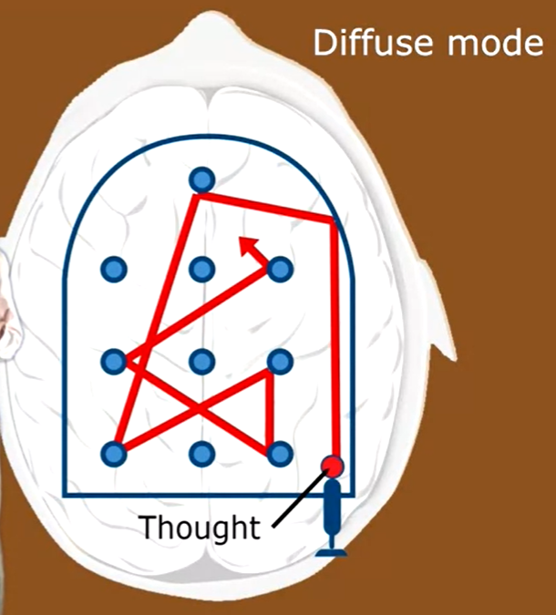
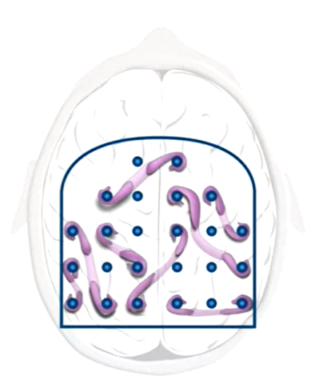

## Work In Progress

## 介绍

- 本文是coursera免费课程：[Learning how to Learn](https://www.coursera.org/learn/ruhe-xuexi) 的笔记
- 这门课的目的：通过了解**精神学、心理学**原理，提高学习效率，减少挫败感
- 《学习之道》这本书是这门课的书面材料，书的作者是课程主讲老师
- 这门课视频内容大概10h，值得花时间去上，但是如果能理解这篇文章总结的内容，那么可以节省掉看课程视频时间，如果遇到不理解的地方，可以上coursera网站看原课程（https://www.coursera.org/learn/ruhe-xuexi）

## 两种思维模式

人的大脑有两种思维模式:

|  Focused Mode 专注模式   | Diffuse Mode 发散模式  |
|  ----  | ----  |
| 集中精力解决单一问题  | 放松的思考模式 |
| 熟练掌握的内容  | 新事物学习，获取灵感 |
| 顺序思考  | 整体思考 |
| 熟练掌握的内容  | 新事物学习，获取灵感 |

以弹珠游戏类比大脑的思维：

- 专注模式下，大脑遇到已知问题，能快速定位到已掌握的知识，利用训练好的知识回路，专一且迅速的解决问题，但是当遇到新问题时，专注模式就有局限性，由于关注于细节，大脑无法将更多的知识回路连接。

- 发散模式下，大脑处于放松状态，不考虑细节，思维灵活跳跃，能从整体层面解决问题，更有助于发挥创造力。

举个例子：

Salvador Dali，20世纪著名超现实主义画家。他有一个有趣的方法，来帮他创造富有创造性的作品：坐在椅子上，放松大脑，模糊的思考着之前专注的事情，手上拿着一串钥匙晃悠，当他睡着时，钥匙会掉落在地上，把他吵醒，这样他就能把脑子里刚刚**发散模式**下的联想和点子集中起来，带着它们回到**专注模式**。

上个例子佐证了发散模式对创造力的作用。这种作用不光能发生在艺术家身上，在Thomas Edison这个著名发明家的身上也有印证。(只不过他手里拿的是滚珠轴承)

因此，**两种思维模式需要结合使用，灵活转换**

## 学习的本质

人类的两种记忆:

|  Working Memory 工作记忆   | Long-term Memory 长期记忆  |
|  ----  | ----  |
| 短期记忆 | 长期记忆 |
| 负责处理即时的有意识的想法 | 已掌握的知识，需要时常复习，否则就会被大脑“代谢”清除掉 |
| 类似于计算机内存，或者一块小黑板 | 类似于硬盘，或者一个存储仓库 |
| 例如你尝试在脑海中用多个概念串联起来去解决一个当下遇到的问题 | 例如你回忆99乘法表去计算9×9的结果 |
| 存储于大脑的前额皮质，与大脑的其他部位可以联系 | 占据大脑大片区域 |
| 容量较小，因人而异 | 容量巨大 |

专注模式下，集中注意力，工作记忆区域活跃，此时就好像你脑子里有一只注意力章鱼，它必须将触角穿过工作记忆的四个插槽，从而帮助你把大脑里不同区域信息联系起来

发散模式下，长期记忆随机连接

知识的掌握在于：将**短期记忆**转化为**长期记忆**，这个过程就是学习的过程

高中学过生物的应该记得膝跳反射实验、神经元、突触，和下面这张图（不记得的、没学过的也没关系

如上图所示，神经突触是神经元之间的连接，直径小于1微米（人类头发直径约20微米）

而**我们人类的所有记忆，就存储在大脑的亿万个神经突触里**

学习的过程，就是记忆的形成过程，也就是神经连接的建立过程，当你第一次接触一个新知识时，你的大脑里会存在一个真实的神经回路：

**刚形成的回路是不牢固的**，因为不论是学习专注，还是天马星空，只要你的思维存在，大脑就在活动，大脑中会不断发生着突触更迭的代谢活动：新的突触不断形成，其他突触消失。即使是睡一觉，睡前和睡后的你已经不是同一个你了

活体动物大脑内部成像图

因此，对于新的的知识，新建立的神经回路，如果不加以巩固，这个神经回路就会很容易在大脑昼夜不断的活动中消失。

那么**怎样巩固记忆**：

- **间隔重复**：刻意的进行反复练习，每次练习中间要有间隔，不断增大两次练习之间的时间间隔。（同样次数的练习，分散在几天中做的效果 比集中在一个晚上做更好）
- 将知识和 人类**感官联系**，如视觉/听觉/触觉/情感，更有利于记忆，例如笔记，图像。（没有图的文章就是耍流氓）
- **充足睡眠+睡前回顾**：睡眠对于学习至关重要，入睡时脑细胞会缩小 使得专注学习时产生的代谢毒物可以被清除，且大脑会在睡眠期间自动清理不重要的记忆，并在潜意识中排演睡前学习的内容。因此睡前花几分钟回顾学习内容，有助于记忆。

 

## 拖延症

拖延症是个普遍的现象，在所有人身上多多少少都有体现，这是因为，拖延是大脑做出的自然反应。

当你遇到不想做的事情时感受到不快，这种刺激(Cue)激活了大脑中与疼痛相关的区域，大脑就会迅速作出反应去寻找停止这种负面刺激的方式，即转移注意力到另一件令你愉快的事情上，从而让你在短期内感到舒服一些。

这种拖延行为成为习惯，就是拖延症的源头。

对抗拖延症有几个技巧：

- 有研究人员发现，当人们真正去做不喜欢的事情后，这种精神上的抵触和不适很快就会消失。了解这个原理，在遇到不想做的事情时，暗示自己**先开头去做很快就能克服**，就可以减轻负面刺激带来的不快感
- **番茄工作法**：利用计时器或者番茄钟，**计时25分钟**，这25分钟内排除一切干扰集中精力专注，专注结束后，**计时5分钟**，给自己一些奖励：放松一下/起来溜达一圈/上网冲冲浪/吃点零食/聊会天。30分钟一次循环，这样的时间效率会相当高，计时器的作用，就是Cue，提醒你切换专注模式和发散模式。（25分钟的专注，对于大多数人来说，应该不难。但是如果你发现自己很难持续专注25分钟，那可以循序渐进，先从10分钟开始可以训练自己的专注耐力）

## Chunk 组块

**chunk**：是指大脑可以轻松使用的小而紧凑的信息片段（可以理解成多个神经元组成的回路或网络

**chunking**：根据意义和逻辑将信息碎片拼接起来，得到更容易记忆的chunk的思维过程（类似拼图的过程，拼图碎片棱角和图像就是相互连接的信息和逻辑。一堆拼图碎片是凌乱无意义的，理清了所有碎片的相互关联，拼成整体后，才有助于记忆

例如，S,T,A,R四个字母单独看，都是单纯的无意义字母，组合成STAR后，就是一个有意义的词，你就能联想到五角星和星空，这就是一个chunk的例子，在这个chunk背后，真实存在着相互连接的神经元，包含了四个字母、五角星和星空的形象。

专注学习、重复训练的过程，就是建立chunk的过程，当chunk建立后，神经回路里的任何一点，都能引导你串联整个记忆回路，人类思维、复杂的神经活动、记忆的存储，都依靠大脑中众多的chunks。

那么怎样**建立可靠的chunk**：

**1.开启专注模式**

集中注意力，切断一切外界干扰，不能让有限的工作记忆被其他事情占用。

例如呆在一个安静的环境，打开手机电脑的勿扰模式，将手边无关的东西都拿开，打开番茄钟计时，然后开始专注。

**2.理解基础知识**

建立chunk并理解基本概念，只有在理解的前提下，大脑才能将新形成的神经回路与其他的神经回路进行联系，否则形成的 Chunk 就是无用的

将新知识与已掌握的知识相关联

**3.practice**

do it yourself

知道怎么使用/何时使用chunk

gaining context获取背景知识，从很宽的角度去理解chunk如何融入架构

（例如学习前，先看每张小标题/图片/章节大纲/流程图/图标/概念图）

4.recall（重复）
<!-- 
单脱离书本纯回忆关键点，

在最初学习场景之外（不同环境）回忆知识点，易于加深印象

（个人理解就是通过不同的环境和角度，去全面理解所学知识的各个方面，是间隔重复的一种方式，也是避免单环境下的知识误区，就像在不同项目去部署webpack，每一次部署都是间隔重复能加深记忆，每一次部署遇到不同的问题和需求，能使我们对webpack理解更全面和贯通）

5.transfer知识迁移

联系相似chunk，有助于加深理解，学习新知识

6.交替学习 interleaving

在同一段时间选择不同知识点全部练习

不仅要学 basic chunk

还要学如何应用chunks

比如在学习前先看看章末习题

比如在掌握了how to之后，思考why to ，when to

在刚开始学习一个新概念时，大量的信息涌入，认知负载（Cognitive Load）很重，使你无法很好的把握。大脑需要一个过程来理解和消化这些内容并将它们组合到一起，这个过程就是 Chunking

一堆散碎的拼图碎片，如果找不到相互契合的锯齿边，就拼不到一起，就像知识之间没有联系

神经科学认为 Chunk 的本质是由于意义联系或反复使用而形成的神经回路，而通路中的神经元往往被同时激活，使得你在回忆一个概念或是执行一项操作时能够顺利高效。

良好的 Chunking 能够使你更容易地回想起所学的内容，更有助于将已经学习的部分嵌入到更大的框架之中。

从 Working Memory 的角度来讲，一个良好的 Chunk 只占用一份空间，只需要很少一部分注意力就可以激活整个 Chunk 的神经回路。而没有经过 Chunking 的等量信息则会占用多得多的空间。

在母语习得的过程中，当母亲教孩子说“mama”，在孩子的大脑中连接“mama”这个词的声音和母亲的相貌的神经回路就会不断牢固。

拆分chunk

roadmap：不要纠结于单个步骤，而是去关注步骤之间的联系。

chunk的形成：

- 集中，排除干扰，不让无关的事情占用工作记忆
- 主动理解知识
- 扩大思维范围，了解当前正在学习内容的上下文Context，把已掌握的知识和正在学的建立联系
- 复盘/回想（费曼学习法）
- 避免能力错觉(以为自己掌握了)，例如看书时划线和高亮标注，很容易形成自己”标注了就是会了“的错觉，第一在旁边写上自己的理解更容易掌握，第二不断给自己安排小测试
- 迁移。chunking的特点就是不光掌握特定知识，还有助于学习其他领域知识，因为chunk之间可以相互联系，也就是迁移。一个人如果掌握很多chunk，大脑里存储了很多相互有联系的神经回路，在 Diffuse Mode发散模式下，很容易找到新问题得解决方案，或者新的灵感 -->

## 习惯的四要素

1. Cue：触发僵尸模式的外界刺激。比如待办清单上的第一项，朋友发来的微信。Cue 大致可以分为四类：时间、地点、感受、反应
2. Routine：受到刺激后习惯性做出的反应。
3. Reward：习惯给予的奖励使他得以存在下去，最简单的例子就是在你拖延时感受到的短时间的愉悦
4. Belief：习惯的力量之所以强大，是因为你在内心深处往往认为它们是无法被改变的。

习惯性反应并不是完全有害的，良好的 Chunking 使你在完成一项任务时只需要关注个别关键因素，其余的交给僵尸模式

## 过度学习

在已经掌握知识后，继续反复练习的行为。

很多情况下过度学习是浪费时间

而且因为练习自己已经会的知识，容易造成能力错觉

## 思维定势 Einstellung

事先存在的思维阻碍了更新更好的想法

Diffuse Mode是客服思维定势的好办法

## Interleaving 交错

光拥有chunk是不足以解决问题的，还要求我们能够知道什么时候用什么chunk

锻炼这种能力的方法就是交错：不断的 在需要不同策略和技巧解决的问题 之间 来回反复

有利于培养创造力和灵活性，避免思维定势

例如 可以有意选择不同类型知识/课题 交错学习

### Process and Product

每个人都会对学习感到厌恶和不快，即使是自己擅长甚至喜欢的学科。

会有这些情绪是完全正常的，重要的是如何应对它们。

研究表明，当人开始做令自己感到厌恶的事情一段时间以后，这种厌恶感就会消失。

所以你只需要一些小技巧来熬过最开始的这段时间。

一个有用的窍门是专注于过程（Process）而不是产物（Product）。

过程是指学习的期间内时间的流逝，而产物是指通过学习得到的结果，比如一本完成的练习册。

产物往往是拖延的导火索，而过程反而恰恰其实是大脑最喜欢的。

当你专注于过程，大脑就可以进入僵尸模式无脑前进了。

通过专注于享受学习的过程，你可以避免陷入拖延的恶性循环，还可以反过来利用僵尸模式来帮助你轻松地完成学习目标。

当然在这个过程中总会有事物令你分心，你需要训练在被分心之后任之而去的能力。当然事先将自己安置在一个干扰尽可能少的环境也是很好的选择。

Harnessing Zombies

拖延很容易，而对抗拖延需要消耗大量的意志力（Will Power）。所以尽量使自己处于不需要对抗拖延的境地，或是反过来用尽量少的意志力来利用僵尸模式帮助自己。

根据上面对习惯的分析，要打破拖延的习惯链，只需消耗意志力去改变四个要素中的一个。

Cue：找到令自己进入拖延的刺激并避免它们。最简单的例子，在学习时远离网络和电视。
Routine：有意识地改变日常的一部分，比如定新的计划，或是养成在学习前把手机关闭的习惯。
Reward：尝试引导自己的正面进取情绪来替代拖延带来的快感，比如自豪感、满足感等。又或者允许自己在不拖延完成任务后尽情放松。一个小技巧是将奖励设定为跟 deadline 有关，比如“五点前做完作业就约上同学去吃大餐”。
Belief：相信自己的新策略可以成功打败拖延。可以通过跟志同道合的小伙伴互相监督来促进自信。
Tasklists

坚持写周计划和日计划，并且最好在睡前做，因为研究显示入睡时潜意识会进入类似于 Diffuse Mode 的状态来“消化”和“排练”要完成的项目，从而使你在白天能更好地去完成他们。写计划的另一个好处在于，如果你不这么做，这些项目就会停留在你的 Working Memory 中，占据宝贵的空间。通过将它们转移到纸上，你能够更好地专注于做事情本身。
Eat your frogs first in the moring. 也即把最困难最厌恶的事情放在早上第一件事做。也是老生常谈了。
在日计划中定好结束学习的时间。我们往往只关注在什么时间做什么事情而忽视了从什么时间开始停止做事情，而这其实是很重要的。这么做不仅有助于你的日程规律，还给你更多时间去发展身心健康从而在学业上更加成功。
Metaphor and Analogy

为所学的内容创造比喻（Metaphor）和类推（Analogy）能够帮助你更好地理解内容本身。如前文所述，知识的表示方式对于学习、记忆和推理来说都是至关重要的。比如当 18 世纪的化学家开始想象和可视化分子级别的运动时，他们取得了巨大的突破。比喻和类推的另一个作用在于它能帮助你突破定势。

比喻和类推之所以有这样的作用，是因为它们将新事物与旧的神经回路联系了起来。这样的链接就好比快捷方式 一般，使得大脑能思考得更快、更发散。

The Value of Teamwork

我们经常会遇到，在做计算题时很前面就犯了错误，但却反复检查不出来，使得最终结果也发生错误的情况。在 这是因为在 Focused Mode 下，大脑会倾向于坚持已经建立的推理步骤。与其他人一起合作的价值就在于这样的经历可以填补你思维上的空缺，建立起更强的自我纠正能力。从这个意义上讲，与你一同合作的人们就好像是对你而言的外部 Diffuse Mode。

另外，对身边的人解释所学的内容也有助于自身的学习。

Test Checklist

考试本身是一种非常有成效的学习方式。这里介绍 Dr. Richard Felder 提出的考前 Checklist。

Did you make a serious effort to understand the text?
Diy you work with classmates on homework problems?
Did you attempt to outline every homework problem solution?
Did you participate actively in homework group discussions?
Did you consult with instructors?
Did you understand all of your homework problem solutions?
Did you ask in class for explanations of homework problem solutions that weren’t clear to you?
Did you attempt to outline lots of problem solutions quickly?
Did you go over the study guide and problems with classmates and quiz one another?
Did you get a reasonable night’s sleep before the test?
在理想的状态下，在考试之前能用 Yes 回答以上尽量多的问题。

Test Tips

Hard Start - Jump to Easy

一种考试策略是先解决所有简单的问题然后攻克困难的问题。但这并不对所有人都适用。回想一下关于 Focused Mode 和 Diffuse Mode，如果我们先大概看一眼题目，从困难的问题出发，将它们“加载”到大脑中，然后跳回去做简单的问题，从而使大脑进入 Diffuse Mode，这样就很有可能在较短的时间内找到难题的思路（当然，在你的能力范围内）。这不失为一种在条件允许的情况下可以尝试的策略。

如果你仔细回忆一下过去考试的经历，肯定会有几次是在走出考场之后才察觉到自己的错误或是想到解决难题的思路。这就是因为如果你不刻意去做，考试结束后大脑才能进入 Diffuse Mode。

Get Excited

当你处于紧张状态时，大脑会分泌化学物质引发一系列生理反应。但你可以用不同的方式来解读这些反应。恐惧和兴奋其实是两种很相似的反应。当你坐在考场里，心跳加速，满头是汗，如果你不去想“这场考试让我恐惧”而是“这场考试让我兴奋”，这会对你的考试非常有 帮助。

Deep Breathing

考试时感到心慌是自然反应。你可以通过深呼吸来部分或者全部抵消这一反应。当然，不要等到考试的时候才去做。考前两周就可以开始每天做几分钟的深呼吸，效果更好。

另外，在考试开始前的最后时间里做深呼吸，有奇效。

Don’t Let the Brain Fool Yourself

如上文所述，大脑经常会欺骗你，让你认为自己的解答是正确的。在考试过程中要时刻小心，可以多眨眨眼或是晃晃头，用这种方式来提醒自己稍微往 Diffuse Mode 倾斜一点看看有没有出错，然后再用 Focused Mode 进行 Double Check。

有些类型的题目可以用多种方式解答，检查时换一种方式可以有效防止被大脑欺骗。但有些题目只能检查每一步的逻辑，那么，Do Your Best。

## TL;DR 总结

### **间隔重复**

- 每学一个知识，记笔记（脱离于资料-输出）
- 出练习题，或者笔记留出关键词空缺
- 第二天做完题再学新知识点
- 周期性复习（脱离资料-在脑中梳理的方式）

### **学抽象知识的方法**

专注模式 学习理解 （建立神经元模式）

发散模式 休息 （等待突触链接的形成与强化）

专注模式 复盘练习 （巩固加深神经元模式）

### 记忆形成

工作记忆 working memory（大脑用于处理当下的任务的那部分记忆）

|

|通过不断练习将工作记忆存到长期记忆（**间隔重复Practice and Repetition**）

|

长期记忆 long term memory（存储仓库）